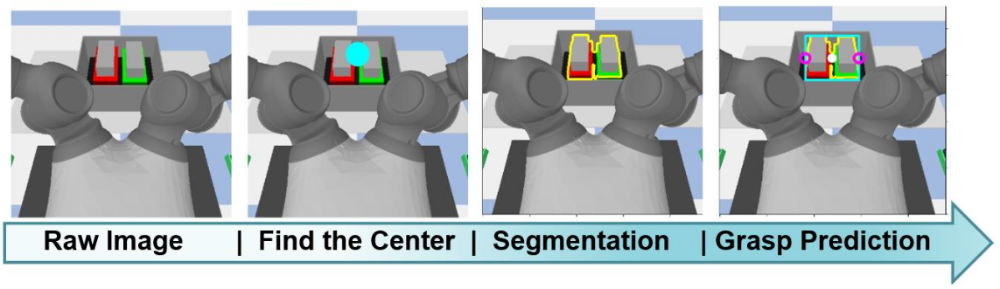

# YumiRobot

## Installation and Setup

### Clone the Repository:

```bash
git clone git@github.com:MohammadKasaei/YumiRobot.git
cd YumiRobot
```

### Set Up a Virtual Environment (optional):

```bash
python -m venv yumi
source yumi/bin/activate  # On Windows use `yumi\Scripts\activate`
```

### Install Dependencies:
Before running the script, make sure you have execute permissions. Run the following command:
```bash
chmod +x install_dependencies.sh
```
To install all the dependencies, simply run:
```bash
./install_dependencies.sh
```
Wait for the script to complete. Once done, all the required dependencies should be installed in your environment.

## Download SAM Models

Click the links below to download the checkpoint for the corresponding model type.

- **`default` or `vit_h`: [ViT-H SAM model.](https://dl.fbaipublicfiles.com/segment_anything/sam_vit_h_4b8939.pth)**
- `vit_l`: [ViT-L SAM model.](https://dl.fbaipublicfiles.com/segment_anything/sam_vit_l_0b3195.pth)
- `vit_b`: [ViT-B SAM model.](https://dl.fbaipublicfiles.com/segment_anything/sam_vit_b_01ec64.pth)

After downloading, place the models into the `sam_harmony/models/` folder. By default, we use the `vit_b` model, but it can be replaced by the other model, to do that, you should set the `sam_model` argument of `InboxGraspPrediction` class once creating an instance of it.

## Running
After installing all the dependencies and downloading the models and placing them into the `sam_harmony/models/` folder, you can run the simulator. We also provide a version that does not include the vision pipeline, so you do not need to download the models.

## Vision-based Grasping from the Box
```bash
python -m tests.harmony_test_vision
```
Once everything is successfully installed, you'll see a box containing four racks randomly placed in front of the simulated Yumi robot, and the robot will perform a rack extraction task.


The vision pipeline is composed of four stages:



## Blind Grasping from the Box
```bash
python -m tests.harmony_test_vision
```
Once everything is successfully installed, you'll see a box containing four racks placed in a fixed position in front of the simulated Yumi robot, and the robot will perform a rack extraction task.


# License
This project is licensed under the MIT License.

# Acknowledgments
This work is supported by EU H2020 project Enhancing Healthcare with Assistive Robotic Mobile Manipulation (HARMONY, 101017008).

